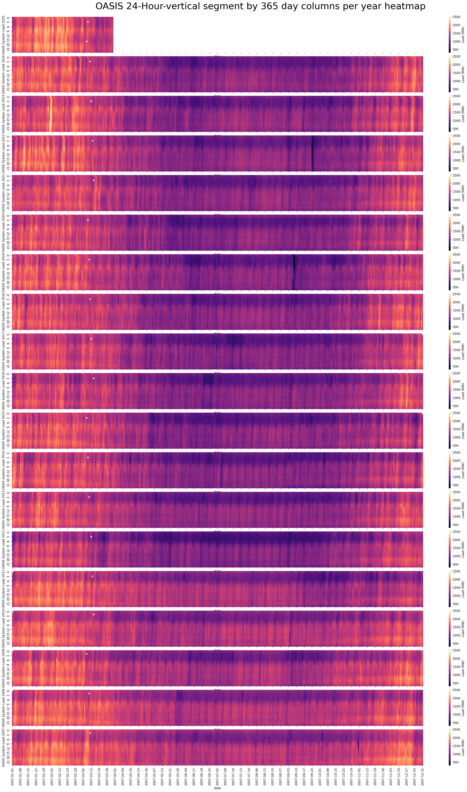

# novascotia-wind-grid
Nova Scotia hourly grid and hourly wind speed matching - Python machine learning optimizations

## Basic command to spin up temporary docker container
```
docker run --rm -p 8889:8888 -v "/$(pwd):/home/jovyan/work" quay.io/jupyter/base-notebook start-notebook.py --NotebookApp.token='my-token'
```

Note that the JupterLabs Notebooks code/work/data that is saved as files will remain after the container is destroyed on exit, but the Python kernel software packages the JupyterLabs notebooks use each time requires redownloading/reinstalling.

Ideally one would make a permanent docker container with the docker-compose.yml (working on that next), or just remove the (--rm from the command), to not require installing the environment each day, but you can exit your browser just as long as you don't stop Windows Docker Desktop or the running docker container in the git bash command line for example. I haven't tested this repo in Linux or Mac, so you might have to tweak some things to get it working.

## Simple install instructions inside most of these Jupyter notebooks:
```
!pip install pandas numpy scipy kaleido==0.2.1 matplotlib pyarrow pooch seaborn plotly xarray ipywidgets
```

### To use the cleaned up NSP OASIS hourly load MW from 2007-2025 
#### (Updated to 2025-03-31)
See the heatmap image below
```
import pandas as pd
hourly_df2 = pd.read_parquet('./oasis_07_25.parquet')
hourly_df2
```

<strong>Reference:</strong> Nova Scotia Power hourly data source:

[https://www.nspower.ca/oasis/monthly-reports/hourly-total-net-nova-scotia-load](https://www.nspower.ca/oasis/monthly-reports/hourly-total-net-nova-scotia-load)

### WARNING:
If any code happens to break, keep in mind the large 300MB - 1GB parquet files that host the wind/weather data cannot be uploaded into GitHub.

If any other code breaks, one thing that happened to me during development is the kaleido software package had a new version released that prevented creating images which caused me and others some peril. I have since locked the older working version in, but other packages might update and break things as well.

### Note:
Please reference my name and thesis for the Nova Scotia Power Plant work if you happen to use any of the power plant data information in a paper as it took me a number of years to put all this together and I would appreciate it! When I get some time I will update the powerplant csv to include the newer major power plants.

Thompson, Jacob Lawrence (2016), Atlantic Canada’s Distributed Generation Future: Renewables, Transportation, and Energy Storage, Retrieved from: https://library2.smu.ca/xmlui/handle/01/26625 and https://github.com/jacobthompson101/novascotia-wind-grid

Keep in mind I haven't updated new wind farms after maybe 2016+ onward, so this is bound to be missing some of the newer wind farms, and does not have any of the ~11,000 distributed solar PV locations.

WARNING that these JupyterLabs notebooks are messy at best! I'll try and load a cleaned up version that doesn't have all the incremental steps, and so that it can run with the parquet and CSV files that are actually available, i.e. most things will be broken at first, so just comment out code that doesn't have associated data files.

## Research Poster:
<strong>Authors:</strong> Jacob Thompson BASc. MSc., and Dr. Martin Tango

"Nova Scotia’s Hourly and Climate Wind Data, Energy Storage, Hydrogen, and approaching 100% Renewable Energy using Wind-Water-Solar with EnergyPLAN"

Event: Nova Scotia Offshore Wind R&D Conference 2024


## Make the heatmap below yourself with the OasisHourly.ipynb notebook:

