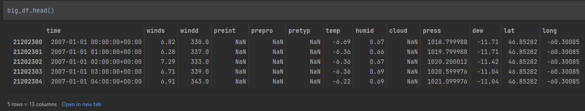

# novascotia-wind-grid
Nova Scotia hourly grid and hourly wind speed matching - Python machine learning optimizations

## Basic command to spin up temporary docker container
```
docker run --rm -p 8889:8888 -v "/$(pwd):/home/jovyan/work" quay.io/jupyter/base-notebook start-notebook.py --NotebookApp.token='my-token'
```

Note that the JupterLabs Notebooks code/work/data that is saved as files will remain after the container is destroyed on exit, but the Python kernel software packages the JupyterLabs notebooks use each time requires redownloading/reinstalling.

Ideally one would make a permanent docker container with the docker-compose.yml (working on that next), or just remove the (--rm from the command), to not require installing the environment each day, but you can exit your browser just as long as you don't stop Windows Docker Desktop or the running docker container in the git bash command line for example. I haven't tested this repo in Linux or Mac, so you might have to tweak some things to get it working.

## Simple install instructions inside most of these Jupyter notebooks:
```
!pip install pandas numpy scipy kaleido==0.2.1 matplotlib pyarrow pooch seaborn plotly xarray ipywidgets
```

### To use the cleaned up NSP OASIS hourly load MW from 2007-2025 
#### (Updated to 2025-03-31)
See the heatmap image below
```
import pandas as pd
hourly_df2 = pd.read_parquet('./oasis_07_25.parquet')
hourly_df2
```
 
<strong>Reference:</strong> Nova Scotia Power hourly data source:

[https://www.nspower.ca/oasis/monthly-reports/hourly-total-net-nova-scotia-load](https://www.nspower.ca/oasis/monthly-reports/hourly-total-net-nova-scotia-load)

### To access this 2007-2022 Darksky Weather data for 230 coordinates evenly distributed across Nova Scotia land area
See the Nova Scotia map in the posters with a lat/long grid to visualize.
```
big_df = pd.read_parquet('big_dfnsdup13col07_24.parquet')
```
Warning ~600 MB! This file isn't in the GitHub repo, please find it on my server here:
[https://wiwasolvet.ca/big_dfnsdup13col07_24.parquet](https://wiwasolvet.ca/big_dfnsdup13col07_24.parquet)

### WARNING:
If any code happens to break, keep in mind the large 300MB - 1GB parquet files that host the wind/weather data cannot be uploaded into GitHub.

If any other code breaks, one thing that happened to me during development is the kaleido software package had a new version released that prevented creating images which caused me and others some peril. I have since locked the older working version in, but other packages might update and break things as well.

### DarkSky Data! (10 m surface wind hub height)
```
# big_df2 = big_df[["time","winds","windd","preint","prepro","pretyp","temp","humid","cloud","press","dew", "lat", "long"]]
# Note that energy content in the wind is most affected by wind speed first, and then in no certain order: pressure, humidity, and temperature.

# You can see my process in some of the Jupyter notebooks the methods I used to reduce the final data sizes to make it easier to work with on a standard computer.
# That's a 2400MB reduction in RAM, going from about 4000 MB to 1600 MB, by only using 11 columns of 18, and by only working with 2007-2022 data and not 1990+
# I only use the 2007+ weather data because I only have old OASIS data that was originally published that year.
>> like in the original ~1GB parquet file that I had to compile from 3 smaller parquet files so my laptop wouldn't run out of memory in pandas.

Note: PEI data is not uploaded to my server yet as I have to process the raw CSV files first into a parquet for the 41 coordinates.
```

Based on the original old license. Please reference DarkSky when using this dataset and use one of the 3 "poweredby" DarkSky logos wherever the data is used.



### OpenWeatherMap Offshore Weather Data - 4 reference sites (10 m surface wind hub height)

Weather data provided by OpenWeather

https://openweathermap.org/

Open Licenses ([CC BY-SA 4.0](https://creativecommons.org/licenses/by-sa/4.0/) and [ODbL](https://opendatacommons.org/licenses/odbl/))

```
owm_hourly_fourrefcases_12col_07_25.parquet
owm_hourly_fourrefcases_2000_2025.parquet
```


### Note:
Please reference my name and thesis for the Nova Scotia Power Plant work if you happen to use any of the power plant data information in a paper as it took me a number of years to put all this together and I would appreciate it! When I get some time I will update the powerplant csv to include the newer major power plants.

Thompson, Jacob Lawrence (2016), Atlantic Canada’s Distributed Generation Future: Renewables, Transportation, and Energy Storage, Retrieved from: https://library2.smu.ca/xmlui/handle/01/26625 and https://github.com/jacobthompson101/novascotia-wind-grid

Keep in mind I haven't updated new wind farms after maybe 2016+ onward, so this is bound to be missing some of the newer wind farms, and does not have any of the ~11,000 distributed solar PV locations.

WARNING that these JupyterLabs notebooks are messy at best! I'll try and load a cleaned up version that doesn't have all the incremental steps, and so that it can run with the parquet and CSV files that are actually available, i.e. most things will be broken at first, so just comment out code that doesn't have associated data files.

## Research Poster 1: Nova Scotia Offshore Wind R&D Conference 2024
<strong>Authors:</strong> Jacob Thompson BASc. MSc., and Dr. Martin Tango

"Nova Scotia’s Hourly and Climate Wind Data, Energy Storage, Hydrogen, and approaching 100% Renewable Energy using Wind-Water-Solar with EnergyPLAN"


## Make the heatmap below yourself with the OasisHourly.ipynb notebook:


## Research Poster 2: Atlantic Canadian Conference on Energy System Modelling 2025
### (continued and extended from previous work):
<strong>Authors:</strong> Jacob Thompson BASc. MSc., and Dr. Martin Tango

"Nova Scotia’s Long Duration Energy Storage, Sector-Coupling Hydrogen, Captured Waste Heat, and 100% Renewables Total Primary Energy Supply"

Note: this poster adds in 6 new charts/figures with offshore wind data based on 2000-2025 hourly OWM data for 4 reference sites. I added 5 new graphics to highlight best practices in offshore HVDC transmission lines from NEMOEC, I updated the OASIS hourly dataset from NSP to include available 2025 data and updated the annual heatmap and winter/summer chart. 
I included the Bubble Curtain graphic and the Meridian Kadlu Ocean Noise Python package because I believe this is important future work to get proper EIA approvals while building offshore wind turbine foundations and social acceptance of these projects.


## References for easy access to hyperlinks
1. GreenPowerLabs created the Solar Map. [http://www.greenpowerlabs.com/services-overview/](http://www.greenpowerlabs.com/services-overview/)
2. The Department of Energy created the Nova Scotia Wind Atlas. [http://www.nswindatlas.ca/](http://www.nswindatlas.ca/)
3. Dr. Richard Karsten et al created the Tidal Map. [http://nswebguide.com/atei/](http://nswebguide.com/atei/)
4. Jacob Thompson created Nova Scotia’s Energy Map: [www.gonotes.org](https://www.gonotes.org)
5. CESAR created [http://www.cesarnet.ca/visualization/sankey-diagrams-canadas-energy-systems](http://www.cesarnet.ca/visualization/sankey-diagrams-canadas-energy-systems)
6. US DOE (2024), Hydrogen Shot, Retrieved from: [https://www.energy.gov/eere/fuelcells/hydrogen-shot](https://www.energy.gov/eere/fuelcells/hydrogen-shot)
7. NSP (2024), NSP Grid Scale Batteries installation dates, Retrieved from: [https://www.nspower.ca/cleanandgreen/innovation/grid-scale-batteries](https://www.nspower.ca/cleanandgreen/innovation/grid-scale-batteries)
8. NSP (January 2023), Evergreen IRP Draft Results and Process Update January 13, 2023, pages 19, Retrieved from: [https://www.nspower.ca/docs/default-source/irp/evergreen-irp-update-january-2023.pdf?sfvrsn=46ec6181_1](https://www.nspower.ca/docs/default-source/irp/evergreen-irp-update-january-2023.pdf?sfvrsn=46ec6181_1)
9. DarkSky Hourly Weather Data (1990-2022), Retrieved from: [https://darksky.net](https://darksky.net)
10. EnergyPLAN annual enegy model, software Retrieved from: [https://energyplan.eu](https://energyplan.eu)
11. Thompson, Jacob (2016). Atlantic Canada’s distributed generation future : renewables, transportation, and energy storage 
[https://library2.smu.ca/xmlui/handle/01/26625](https://library2.smu.ca/xmlui/handle/01/26625)
12. Government of Canada (Oct 2024) Regional Assessment of Offshore Wind Development in Nova Scotia, Retrieved from: [https://iaac-aeic.gc.ca/050/evaluations/proj/83514?culture=en-CA](https://iaac-aeic.gc.ca/050/evaluations/proj/83514?culture=en-CA)
13. Nova Scotia Government (2024). Offshore Wind, Retrieved from: [https://novascotia.ca/offshore-wind/](https://novascotia.ca/offshore-wind/)
14. NetZeroAtlantic (2023), Value Mapping Nova Scotia’s Offshore Wind Resources, Retrieved from: [https://netzeroatlantic.ca/sites/default/files/2023-04/Value%20Mapping%20Nova%20Scotia%20Offshore%20Wind%20Resources.pdf](https://netzeroatlantic.ca/sites/default/files/2023-04/Value%20Mapping%20Nova%20Scotia%20Offshore%20Wind%20Resources.pdf)
15. "Pearre N, Swan L (2020). Maritime Regional Wind Energy Resources: Determining preferred regions for additional onshore and offshore wind energy development."
[https://resl.me.dal.ca/wp-content/uploads/2021/01/maritime-regional-wind-energy-resources-final.pdf](https://resl.me.dal.ca/wp-content/uploads/2021/01/maritime-regional-wind-energy-resources-final.pdf)
16. Nova Scotia Wind Grid (2024), Github code repo, Retrieved from: [https://github.com/jacobthompson101/novascotia-wind-grid](https://github.com/jacobthompson101/novascotia-wind-grid)
17. Bubble Curtain graphic: [https://www.maritime-executive.com/article/vineyard-wind-tries-bubble-curtain-system-to-cut-pile-driving-noise](https://www.maritime-executive.com/article/vineyard-wind-tries-bubble-curtain-system-to-cut-pile-driving-noise)
18. Ocean Soundscape Map. Meridian: [https://meridian.cs.dal.ca/ocean-soundscape-atlas/](https://meridian.cs.dal.ca/ocean-soundscape-atlas/)
19. Kadlu OceanNoise Python Package: [https://docs.meridian.cs.dal.ca/kadlu/install.html](https://docs.meridian.cs.dal.ca/kadlu/install.html)
20. New England Maritimes Offshore Energy Corridor (NEMOEC): [https://nemoec.com](https://nemoec.com)
